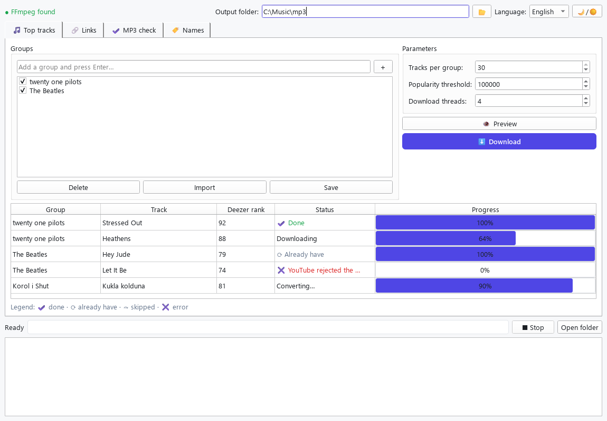

# Топ‑треки групп → MP3

[](LICENSE)
[](https://github.com/Laowy12/Top-tracks-to-mp3/releases/latest)
[](https://github.com/Laowy12/Top-tracks-to-mp3/releases/latest)
[](https://www.python.org/downloads/)

[English version →](README.md)

Утилита получает до 30 популярных треков для каждой группы из `groups.txt`, отбрасывает малопопулярные позиции, ищет оставшиеся в разделе **Songs** YouTube Music и извлекает MP3 с помощью `yt-dlp` и FFmpeg. Используйте её исключительно для аудио, на которое у вас есть права или разрешение правообладателя.

Есть два способа работы:

- **Графический интерфейс** (`gui.py`) — окно с вкладками, редакторами списков, прогрессом и кнопкой «Стоп». Самый простой путь, в том числе в виде готового `.exe`.
- **Командная строка** — три скрипта (`download_top_tracks.py`, `download_music_links.py`, `check_mp3.py`) для автоматизации и опытных пользователей.

Интерфейс и сообщения в консоли доступны на **русском и английском языках**. При первом запуске язык определяется по системе, а переключить его можно в любой момент прямо в окне (или ключом `--lang` в командной строке).



## Установка

1. Установите [FFmpeg](https://ffmpeg.org/download.html) и убедитесь, что команда `ffmpeg -version` работает в PowerShell.
2. В этой папке выполните:

```powershell
python -m pip install -r requirements.txt
```

3. Добавьте группы в `groups.txt`, по одной на строку.
4. При необходимости укажите русские варианты имён в `aliases.csv`. Автоматический перевод названий песен ненадёжен, поэтому этот файл задаёт точные варианты, которые попадут в имя MP3.

Пример `aliases.csv`:

```csv
group,track,group_ru,track_ru
The Beatles,,Битлз,
The Beatles,Yesterday,Битлз,Вчера
```

## Графический интерфейс

Запустите окно командой:

```powershell
python .\gui.py
```

В окне четыре вкладки:

- **🎵 Топ‑треки** — отметьте группы галочками (список редактируется прямо здесь и сохраняется в `groups.txt`), задайте число позиций, порог рейтинга и количество потоков. Кнопка **Предпросмотр** показывает, что будет скачано, без загрузки; **Загрузить** качает MP3. В таблице виден статус и индивидуальный прогресс каждого трека.
- **🔗 Ссылки** — вставьте ссылки YouTube Music (по одной на строку, сохраняются в `music_links.txt`) и скачайте их.
- **✔ Проверка MP3** — выберите папку и проверьте целостность файлов; отчёт можно сохранить.
- **🏷 Имена** — таблица `aliases.csv` для русских вариантов имён групп и песен.

Внизу окна — общий прогресс, журнал и кнопка **Стоп** (аккуратно прерывает текущую операцию). Статус FFmpeg и папка вывода видны в верхней строке рядом с переключателем языка и переключателем светлой и тёмной темы. Без FFmpeg загрузка блокируется с подсказкой, как его установить.

## Запуск из командной строки

Сначала посмотрите список без загрузки:

```powershell
python .\download_top_tracks.py --dry-run
```

Затем скачайте:

```powershell
python .\download_top_tracks.py
```

Файлы появятся в `mp3`. Формат имени: `Название группы — Название песни.mp3`.

По умолчанию программа берёт максимум 30 треков и пропускает всё, у чего рейтинг Deezer ниже `100000`. Поэтому у группы может получиться меньше 30 файлов — именно так исключаются непопулярные песни. Чтобы сделать отбор строже, например:

```powershell
python .\download_top_tracks.py --min-rank 250000
```

Чтобы взять меньше позиций из рейтинга, добавьте, например, `--limit 10`.

После завершения программа покажет сводку: число успешно скачанных в этом запуске песен и их суммарную длительность в минутах и секундах. Уже имеющиеся в папке `mp3` файлы пропускаются и в повторный итог не входят.

## Скорость загрузки

Загрузки и конвертация выполняются параллельно: по умолчанию одновременно обрабатываются 4 трека. На быстром интернете и SSD можно увеличить лимит, например до 6:

```powershell
python .\download_top_tracks.py --workers 6
```

Не стоит сразу ставить максимальное значение: YouTube может временно ограничить слишком много одновременных запросов. Если трек не скачался и вы видите ошибку `403`, не страшно: программа уже автоматически повторила попытки (до трёх раз с нарастающей паузой). Обычно достаточно запустить её ещё раз либо уменьшить число потоков до `--workers 3` или `--workers 2`. Успешно созданные MP3 будут пропущены, а не скачаны заново.

## Отдельные ссылки YouTube Music

В [music_links.txt](music_links.txt) вставьте по одной ссылке на отдельную песню YouTube Music на строку, затем выполните:

```powershell
python .\download_music_links.py
```

Скрипт получит исполнителя и название из метаданных ссылки, применит совпадающие переводы из `aliases.csv`, скачает MP3 в ту же папку `mp3` и выведет суммарную длительность. Для таких ссылок безопасный лимит — 3 параллельные задачи; изменить его можно через `--workers 4`.

## Проверка битых MP3

После загрузки можно полностью проверить все аудиофайлы без их изменения:

```powershell
python .\check_mp3.py
```

Проверка декодирует каждый MP3 через FFmpeg. Если найдутся повреждённые или оборванные файлы, они останутся на месте, а их имена и причина будут записаны в `broken_mp3_report.txt`.

Поиск выполняется в разделе **Songs** YouTube Music, поэтому вместо клиповой версии обычно будет выбрана аудиодорожка релиза. Но возможны исключения (remix, radio edit, cover), поэтому перед массовой загрузкой проверяйте `--dry-run`; для критически важной точности лучше расширить утилиту списком согласованных вами URL.

## Справка по командной строке

Каждый скрипт принимает `--lang {en,ru}`, чтобы задать язык интерфейса (иначе он определяется по системе).

`download_top_tracks.py`:

| Ключ | По умолчанию | Описание |
| --- | --- | --- |
| `--groups` | `groups.txt` | файл со списком групп |
| `--aliases` | `aliases.csv` | русские варианты имён |
| `--output` | `mp3` | папка вывода |
| `--limit` | `30` | максимум позиций рейтинга на группу |
| `--min-rank` | `100000` | минимальный рейтинг популярности Deezer |
| `--workers` | `4` | число параллельных загрузок |
| `--dry-run` | выкл. | только показать найденные треки |
| `--lang` | авто | язык интерфейса (`en` или `ru`) |

`download_music_links.py`: `--links` (`music_links.txt`), `--aliases`, `--output`, `--workers` (`3`), `--dry-run`, `--lang`.

`check_mp3.py`: `--folder` (`mp3`), `--workers` (`4`), `--report` (`broken_mp3_report.txt`), `--lang`.

## Сборка .exe под Windows

Чтобы получить один исполняемый файл без установки Python у пользователя:

```powershell
python -m pip install -r requirements.txt -r requirements-dev.txt
pwsh -File build.ps1
```

Готовый файл появится как `dist\MusicTopTracks.exe` (около 55 МБ). Положите рядом с ним `groups.txt`, `music_links.txt` и `aliases.csv` — программа читает и сохраняет данные в папке, где лежит `.exe`, а скачанные MP3 складывает в подпапку `mp3`.

FFmpeg в сборку не входит: он должен быть установлен в системе (команда `ffmpeg -version` должна работать).

## Правовая оговорка

Используйте утилиту только для аудио, на которое у вас есть права или разрешение правообладателя, и для личного использования. Уважайте авторов и условия сервисов, которыми пользуетесь.

## Лицензия

Проект распространяется под лицензией [MIT](LICENSE).
